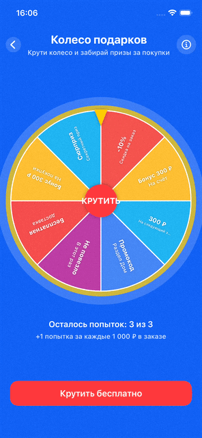

# WheelFeature

Колесо призов с секторами и подписями.

Это черновой шаблон; просьба не обращать внимание на магические числа и кодстайл.



## Формулы

### Секторы

- Колесо вписано в квадрат со стороной `wheelSize`. Радиус круга:
  ```
  wheelRadius = wheelSize / 2
  ```

- Круг делится на `N` секторов. Угловой шаг:
  ```
  anglePerSegment = 360° / N
  ```

- Границы сектора с индексом `index` (отсчёт с 0). Ноль угла — верх круга (стрелка), поэтому сдвиг −90°:
  ```
  start = index × anglePerSegment − 90°
  end   = (index + 1) × anglePerSegment − 90°
  ```

- Дуга рисуется от `start` до `end` против часовой стрелки.

### Подписи на секторах

- Расстояние подписи от центра (доля радиуса):
  ```
  labelRadius = wheelRadius × (2/3)
  ```

- Угол середины сектора (в градусах «от верха», по часовой):
  ```
  midAngle = index × anglePerSegment + anglePerSegment / 2
  ```
  В системе рисования (0° = право, −90° = верх):
  ```
  circleMidAngle = midAngle − 90°
  ```

- Смещение подписи от центра (в координатах экрана):
  ```
  rad = circleMidAngle × π / 180
  dx = labelRadius × cos(rad)
  dy = labelRadius × sin(rad)
  ```

- Трансформации подписи применяются в порядке: сначала поворот на `circleMidAngle`, затем смещение на `(dx, dy)`.

### Анимация

Колесо — это view с `rotationEffect(.degrees(rotation))`. При нажатии «Крутить» выбирается случайный выигрышный сектор `winningIndex`, считается целевой угол:

```
targetRotation = rotation − extraTurns × 360° − winningIndex × anglePerSegment
```

Так колесо делает несколько полных оборотов (`extraTurns`) и останавливается так, чтобы выигрышный сектор оказался сверху (под стрелкой). После окончания анимации выставляется приз и снимается блокировка кнопки.

